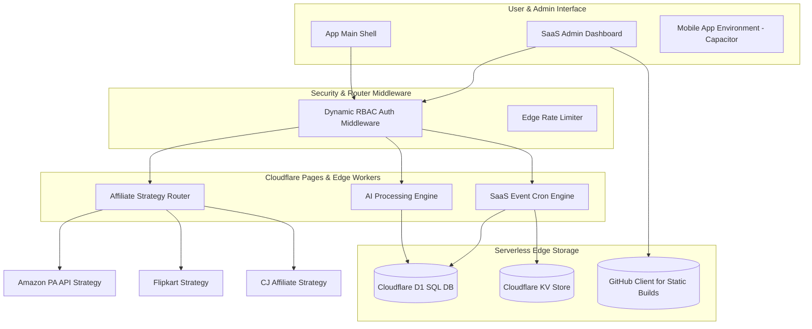

# AXEVORA ENTERPRISE AI GROWTH ENGINE - ANALYSIS & ARCHITECTURE REPORT
**Version:** v1.0  
**Date:** 08/07/2026  
**Author:** Antigravity (AI Pair Programmer)

---

## PART 1: CURRENT ARCHITECTURE & TECH STACK ANALYSIS

### 1. Current Tech Stack
* **Frontend Library:** React 18.3.1 (Single Page Application - SPA)
* **Build Tool & Dev Server:** Vite 5.4.1 + SWC compiler (`@vitejs/plugin-react-swc`)
* **Programming Language:** TypeScript 5.5.3 (Strict typing configurations enabled)
* **Styling:** Tailwind CSS 3.4.11 + PostCSS + Tailwind CSS Animate + Radix UI (shadcn/ui primitives)
* **Routing:** Client-side static routing using `HashRouter` from `react-router-dom` (v6.26.2)
* **Database/Storage:** Static in-memory databases (`.ts` and `.json` tables in `src/data/`) dynamically cached/written to browser's `localStorage`.
* **Backend Services:** 
  * **Cloudflare Workers:** Durable Objects implementation (`workers/chat-server.js`) for real-time WebSocket chat.
  * **Cloudflare Pages Functions:** Serverless HTTP endpoints (`functions/api/send-email.ts`).
* **Authentication & Route Guards:** Client-side local passcode gate system (`src/lib/adminGate.ts`) secured via SHA-256 hash comparison.
* **State Management:** `@tanstack/react-query` (v5.56.2) paired with local React state (`useState`/`useEffect`).
* **AI Integrations:** `@google/generative-ai` (Gemini SDK) primary, Hercai AI and Pollinations.ai (GET APIs) as keyless fallbacks.
* **Wasm & Local Compute Utilities:** `@ffmpeg/ffmpeg` (Wasm video tool), `@imgly/background-removal` (Local image BG eraser), `tesseract.js` (OCR).
* **Mobile App Environment:** Capacitor CLI (`@capacitor/core` & `@capacitor/android` v6.2.1) + `@capacitor-community/admob` for Ads.

---

### 2. Folder Structure
```text
tittoos-toolbox-hub/
├── .github/workflows/         # Automation pipelines (sitemap.yml)
├── android/                   # Capacitor Native Android configuration files
├── content/                   # Flat text/data content definitions
├── functions/                 # Cloudflare Pages Serverless functions
│   └── api/
│       └── send-email.ts      # Send email backend function
├── public/                    # Static site assets (Icons, Images, Manifest)
├── resources/                 # Capacitor/Native assets (splash screens, icons)
├── scripts/                   # CLI maintenance scripts (battle generators, APK publish scripts)
│   ├── generate-battles.js
│   └── upload-to-indus.js
├── src/                       # Main client application
│   ├── components/            # UI components (Custom templates & shadcn/ui)
│   │   ├── ui/                # Radix UI design system primitives
│   │   ├── AdminRouteGuard.tsx
│   │   ├── ToolTemplate.tsx
│   │   └── VersusTemplate.tsx
│   ├── data/                  # Static state databases (Source of Truth)
│   │   ├── blogs.ts
│   │   ├── tools.ts
│   │   └── generated_blogs.json
│   ├── hooks/                 # React dynamic custom hooks
│   ├── lib/                   # Internal libraries & admin configuration logic
│   │   └── adminGate.ts
│   ├── pages/                 # Full screen page containers
│   │   ├── admin/             # Restricted admin manager pages (BlogManager.tsx, BattleManager.tsx)
│   │   ├── apps/
│   │   └── tools/             # 121 flat files representing client utilities
│   ├── services/              # External service API interfaces (AdMob, MagicSearch)
│   └── utils/                 # Business logic, helpers (AI builder, ffmpeg, SEO)
│       ├── aiGenerator.ts
│       └── githubClient.ts
├── workers/                   # Cloudflare Workers WebSocket code
│   └── chat-server.js
├── capacitor.config.ts        # Capacitor mobile packaging config
├── tailwind.config.ts         # Tailwind styling tokens & design variables
├── vite.config.ts             # Vite build & dependency bundling pipeline
└── wrangler.toml              # Cloudflare Workers server configurations
```

---

### 3. Architecture & Key Architectural Pillars

* **Decoupled Serverless / Decoupled Static (JAMstack) Model:**
  * Application builds into static files using Vite.
  * **Build Optimization Script (`generate-static-pages.cjs`):** Build ke baat custom script run hoti hai jo `src/App.tsx` aur `src/data/tools.ts` se routes parse karti hai. Yeh unique routes ke liye SEO flat HTML files (`dist/about.html`, `dist/tools/pdf-converter.html`) render karti hai aur SEO meta, Canonical tags, aur crawling optimized no-script site links inject karti hai.
* **Git-Driven Browser CMS:**
  * `src/pages/admin/BlogManager.tsx` client browser storage me blogs store karta hai.
  * **GitHub Client (`src/utils/githubClient.ts`):** Admin browser environment se user's GitHub Personal Access Token use karke direct repository API (`https://api.github.com/repos/.../contents/src/data/generated_blogs.json`) hit karke updated JSON contents commit karta hai. Is commit trigger se Vercel/Pages CI rebuild auto-start ho jata hai, jisse dynamic blogs static build pages ban jate hain.

---

### 4. System Configuration Reports

* **Routing:** Client routing purely dynamic hash routing (`#/path`) par physical redirects control karti hai. SEO crawling ke liye flat path pages direct pre-render hote hain.
* **Authentication & Authorization:** Browser based local storage validation. Route Guard `AdminRouteGuard.tsx` check karta hai ki kya sessionStorage me correct admin pass code hash hai (jo `.env` se compare hota hai).
* **Database & ORM:** Koi traditional relational/NoSQL hosting service backend me integrated nahi hai. System flat files (`blogs.ts`, `tools.ts`) aur static json files use karta hai jo memory me load hote hain.
* **State Management:** TanStack React Query global cache queries execute karta hai, jisse client performance enhance hoti hai. Local settings key-value entries `localStorage` me save hoti hain.
* **API Structure:** Cloudflare Functions (`functions/api/send-email.ts`) simple edge handlers perform karte hain. Durable object worker stateful WebSocket connections match karta hai chat rooms ke liye.
* **SEO & Metadata:** `react-helmet-async` context runtime tags handle karta hai. Automatic Sitemap generation task (`generate-sitemap.cjs`) build time par active path tree read karke `sitemap.xml` build karta hai aur Google search indexers ko ping notification trigger karta hai (`sitemap.yml`).
* **Security:** Key sensitive variables (`VITE_ADMIN_GATE_HASH`) use hote hain. Client memory tools local state run hote hain jisse security exposure minimum ho jata hai.
* **Build & Deployment:** Build task (`npm run build`) complete assets compiling, static routing files placement, aur dynamic RSS feeds packaging execute karta hai. Deploy actions pages hosting services se managed hain.

---

### 5. Existing Codebase: Strong Points & Weak Points

#### Strong Points (Taakat):
1. **Server Cost zero ke barabar (JAMstack approach):** Database hosting ka recurring kharcha zero hai kyunki GitHub commits hi data modify karti hain aur static build output deploy hota hai.
2. **Edge Compute Power:** Image and video parsing models (FFmpeg, background removal) fully local Wasm configurations use karte hain, server processing overhead zero hai.
3. **Keyless AI Reliability:** Pollinations aur Hercai fallback methods ensure karte hain ki user key input fail hone par bhi functions open rehte hain.
4. **Robust SEO Injection:** Pre-rendering setup dynamically nested links inject karta hai taaki client SPA SEO me optimal score kare.

#### Weak Points (Kamzoriyaan):
1. **Multi-Admin Conflict Risk:** Agar multiple team admins ek saath Blog CMS use karein to concurrent commits overwrite/merge conflict trigger karengi, jisse production deployment build crash ho sakti hai.
2. **LocalStorage Security Vulnerability:** GitHub Private Access token and client API keys straight localStorage variables me store hote hain, jo XSS/Malware exploits ke time dynamic access allow kar dete hain.
3. **Route Guard Verification Localized:** Authentication purely client routing hooks validate karte hain. Koi real server database validation nahi hai.
4. **Directory Clutter:** Ek hi location (`src/pages/tools/`) par 121 flat files modules system ko unorganized banate hain.

---

### 6. Technical Debt & Risk Report

* **Technical Debt:**
  * Sitemap crawler (`generate-sitemap.cjs`) aur static index builder (`generate-static-pages.cjs`) me routing read functions duplicated hain.
  * Tools classification object models `src/data/tools.ts` me hardcoded list form me maintain hote hain.
* **Potential System Risks:**
  * GitHub dynamic updates API calls block limits trigger kar sakte hain (Rate Limiting).
  * Wasm models loading dependency bundles download metrics badha dete hain, low-bandwidth connections par initial screen freeze/blank rendering trigger ho sakti hai.

---

## PART 2: PROPOSED ENTERPRISE LEVEL ARCHITECTURE

Future Enterprise SaaS requirements (Affiliate Managers, AI Deals Engine, Price Trackers, Scheduled Omnichannel Publishers) ke liye monolithic structure scale nahi karega. Hume ek **Modular Strategy-Driven Serverless Edge Architecture** implement karni hogi jo system features ko isolated modules me clean mapping degi.

### 1. Architectural Component Design



---

### 2. Folder Hierarchy Strategy
New modules and files structure modular design follow karega:

```text
src/
├── core/                       # App foundational structures
│   ├── config/                 # Environment configurations
│   ├── router/                 # Routes definitions
│   └── security/               # Encryption, token vault hooks
├── modules/                    # Isolated feature business domains
│   ├── affiliate/              # Affiliate Strategy Module
│   │   ├── strategies/         # Affiliate Network concrete handlers
│   │   │   ├── amazon.strategy.ts
│   │   │   ├── flipkart.strategy.ts
│   │   │   └── base.strategy.ts
│   │   ├── components/         # Affiliate specific UI (link parsers, grids)
│   │   └── hooks/              # useAffiliate hook definitions
│   ├── ai-engine/              # AI Article & Review Generation Module
│   │   ├── pipelines/          # Article parsing chains
│   │   └── templates/          # SEO Prompt templates
│   ├── deals/                  # Deals Engine Module
│   │   └── services/           # Price scraping, discount detection
│   └── publisher/              # Social Media Automations Module
│       └── networks/           # Telegram, Insta, Pinterest channels
├── shared/                     # Reusable assets across modules
│   ├── components/             # Common UI buttons, forms, tables
│   ├── hooks/                  # Global core hooks
│   └── utils/                  # Basic mathematical, string parsing helpers
```

---

### 3. Design Standards & Conventions

1. **Naming Convention:**
   * **Files:** Kebab-case filenames target details batayenge (`amazon-affiliate.strategy.ts`, `deals-list-table.tsx`).
   * **Components:** PascalCase use hoga aur component directory name aur default component export match karega (`src/components/shared/Loader.tsx`).
2. **Coding Convention (TypeScript Strict Rules):**
   * Any interfaces definitions strictly `d.ts` separate contracts ensure karengi. No generic `any` values.
   * Errors handling must use Custom Error wrappers (`AppError`) to catch specific integration API failures safely.
3. **Architecture Rules:**
   * **Open-Closed Principle:** Jab bhi naya network partner (e.g. Hostinger, Ajio) add ho, standard class interface implimentation extension se process ho, existing routes modify nahi honge.
   * **Security Vault:** Local tokens storage dynamic cookies (HttpOnly edge secured) configuration se exchange hoga.

---

## PART 3: PHASE ROADMAP

### Phase 1: Storage & Security Foundation
* **Goal:** Local storage dependency replace karna aur secure admin RBAC deploy karna.
* **Dependencies:** Cloudflare D1 integration setup, admin security system revamp.
* **Priority:** High (P0)
* **Estimated Complexity:** Medium
* **Risk Level:** High (Kyunki client state change hoga)
* **Future Impact:** Ye step data integrity aur high security standard lock karega.
* **Technical Details:** Admin login ko local passcode logic se upgrade karke edge backend (D1 databases) validator me move karna. GitHub personal access tokens ko Edge Server Secret key storage state variables me configure karna.

### Phase 2: Affiliate Strategy Core Engine
* **Goal:** Strategy model implementation for Amazon PA API, Myntra, Ajio etc.
* **Dependencies:** Phase 1 Core Database authentication module.
* **Priority:** High (P1)
* **Estimated Complexity:** High
* **Risk Level:** Medium
* **Future Impact:** Naye affiliate platforms add karne me integration complexity zero ho jayegi.
* **Technical Details:** Abstract interface class `AffiliateNetworkStrategy` define karna. Concrete implementation APIs config structures build karna jo base parameters dynamically parse karke standard card link formatting produce karein.

### Phase 3: Edge AI CMS & Article Pipelines
* **Goal:** AI deals engine development + Content Auto generation Crons.
* **Dependencies:** Phase 1 Storage controllers and Phase 2 details.
* **Priority:** Medium (P2)
* **Estimated Complexity:** Very High
* **Risk Level:** Medium
* **Future Impact:** Automate dynamic blogging workflow without admin manual trigger.
* **Technical Details:** Cloudflare Workers Cron schedules triggers run karein. AI Blog Generator tool engine modules ko dynamic edge scheduler context logic se link karna, taaki content dynamic builds triggers automation execute kare.

### Phase 4: Price Trackers & Smart Coupons
* **Goal:** Real-time pricing indexers aur discount coupon notification center.
* **Dependencies:** Cloudflare Workers KV Cache module.
* **Priority:** Medium (P3)
* **Estimated Complexity:** High
* **Risk Level:** High (API limits rate risks)
* **Future Impact:** Engine to auto detect best deals and updates pricing on pages dynamically.
* **Technical Details:** Web workers periodically target prices parse karein, updates check hone par database records reflect karein aur state updates update tags push notification hooks forward karein.

### Phase 5: Omnichannel Automation Publisher
* **Goal:** Facebook, Instagram, Telegram, Pinterest publishing pipelines.
* **Dependencies:** Complete system core modules stability.
* **Priority:** Low (P4)
* **Estimated Complexity:** Medium
* **Risk Level:** Low
* **Future Impact:** Dynamic traffic acquisition and automated promotions.
* **Technical Details:** Webhook dispatchers structure setup. Auto generated blog posts link meta structures and deals dynamic details platforms feeds integrations templates map integration format process karein.

---

## PART 4: SUMMARY & FUTURE RECOMMENDATIONS

1. **Kya Analyze Hua:**
   * Poora project directory tree, routing structure, sitemap execution, auto-build config.
   * Admin CMS modules jo dynamic inputs database ki jagah client file outputs update control karte hain.
2. **Kya Recommend Kiya:**
   * **Modular dynamic directory strategy:** Domain specific business logic ko pure JS functions controllers modular locations standard folder architectures define karein.
   * **Strategy Patterns:** Dynamic affiliate networks integration patterns use karna to block runtime codebase modifications.
3. **Konsi Files Future Me Modify Hongi (Implementation Steps me):**
   * `src/App.tsx` (Naye enterprise dashboards and affiliate control systems paths map karne ke liye).
   * `src/lib/` (Naye database routing helpers interfaces config logic structures integrate karne ke liye).
4. **Konsi Files Untouched Rehni Chahiye (Critical Core):**
   * `src/pages/tools/` folders inside items (Sare existing 121 client utilities intact rahenge, taaki user base breakdown avoid ho).
   * `capacitor.config.ts` aur native platform configurations (`android/`).
5. **Next Recommended Step:**
   * ChatGPT se is roadmap aur folder architecture design par alignment confirm karwayein.
   * Approval ke baad, Phase 1 (Core Storage & Security Integration) se code foundation start kiya jayega.
