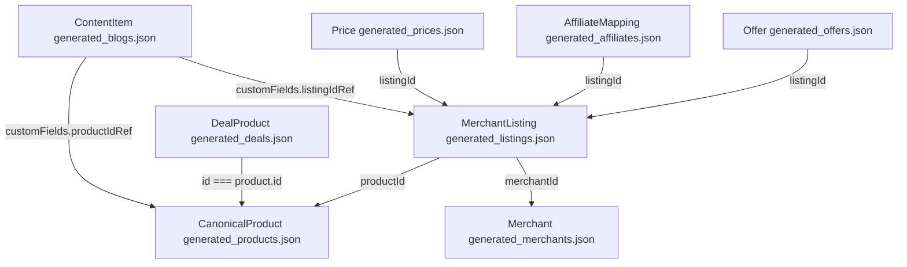

# Axevora Commerce & Affiliate Ingestion Project Memory

This document serves as a persistent memory and state tracker for the **Axevora Enterprise AI Growth Engine** commerce features implementation.

---

## 1. Project Context & Objectives
* **Platform:** Axevora Enterprise AI Growth Engine (Vite + React + TypeScript + Tailwind CSS).
* **Objective:** Manual Commerce Product Ingestion, Amazon Affiliate Tracking Defaulting, and Public Rendering dynamic widgets support.
* **Locked Configurations:** Core CMS, Taxonomy, and Product engines are locked. Modifications must only be done in the designated integration points.

---

## 2. Ingestion & Publishing Workflow (Prompt 09A & 09B)
* **Ingestion Endpoint:** Admin dashboard panel route `/admin/commerce/publish` mapped in [CommercePublisher.tsx](file:///d:/axevora.com/tittoos-toolbox-hub/src/modules/commerce/pages/CommercePublisher.tsx).
* **Backend Ingestion Engine:** Mapped in [PublishingWorkflow.ts](file:///d:/axevora.com/tittoos-toolbox-hub/src/workflows/PublishingWorkflow.ts). It orchestrates atomic multi-file commits using `gitHubClient.commitMultipleFiles()`.
* **Affiliate Configuration Defaults:**
  - If the selected Merchant is Amazon (detected via case-insensitive matching like `amazon_in`), and credentials are not provided:
    * `trackingRef` defaults to `"axevora06-21"`
    * `networkRef` defaults to `"amazon_associates"`
  - If the merchant is non-Amazon:
    * Defaults are NOT applied automatically. The publisher must enter them manually.
  - The correct Axevora Associates tag is strictly **`axevora06-21`**. Legacy incorrect tag **`axevora-21`** has been completely removed and replaced.

---

## 3. Public Rendering & Joins (Prompt 09C)
Commerce data resolution is handled via a lightweight read-only resolver utility [commerceResolver.ts](file:///d:/axevora.com/tittoos-toolbox-hub/src/modules/commerce/services/commerceResolver.ts) using the following relational database schema maps:

### Relational Join Mapping Strategy

### Public Entry Points
1. 🟢 **`/blog/:slug`** ([Blog.tsx](file:///d:/axevora.com/tittoos-toolbox-hub/src/pages/Blog.tsx)):
   * Article body fallback maps: `selectedPostData.content || selectedPostData.customFields?.contentHtml`.
   * Resolves associated commerce products via `productIdRef` and embeds `CommerceProductCard` at the bottom of the article body.
2. 🟢 **`/deals/product/:id`** ([ProductDetails.tsx](file:///d:/axevora.com/tittoos-toolbox-hub/src/modules/deals/pages/ProductDetails.tsx)):
   * Overwrites legacy routing placeholders to fetch actual IDs and render [CommerceProductCard](file:///d:/axevora.com/tittoos-toolbox-hub/src/modules/commerce/components/CommerceProductCard.tsx) dynamically.

### Card UI & Security Guidelines ([CommerceProductCard.tsx](file:///d:/axevora.com/tittoos-toolbox-hub/src/modules/commerce/components/CommerceProductCard.tsx))
* **CTA Priority:** `manualAffiliateUrl` (priority) → `merchantProductUrl` (fallback).
* **CTA Security:** ONLY `http:` and `https:` schemes are allowed. Unsafe schemes (`javascript:`, `data:`) are rejected.
* **Link Target:** Outbound pages open in new tabs with `target="_blank" rel="noopener noreferrer"`.
* **Affiliate Disclosure:** Visually integrated base card disclaimer:
  *"This widget contains affiliate links. Axevora may earn a referral commission if you make a purchase through these links, at no additional cost to you."*

---

## 4. Environment & Validation Status (Prompt 09D)
* **Local Machine State:** Node.js/NPM executables are not registered on the PATH.
* **Test executions:** Builds, tests, and local dev servers are `NOT EXECUTED` due to environment path limitations.
* **Amazon Bot Protection:** Direct automated scraping for `https://link.amazon/B0h17eTum` is blocked by CAPTCHA.
* **Target test product details identified:**
  - Product Name: `Neopticon EBook 11.6" HD Laptop`
  - ASIN: `B0G2MT8YV`
  - Amazon Product URL: `https://www.amazon.in/Neopticon-Student-Celeron-Expandable-Graphics/dp/B0G2MT8YV`
  - Affiliate URL: `https://link.amazon/B0h17eTum`
* **Compile Safety:** Safe empty arrays (`[]`) are initialized in `src/data/` for `generated_products.json`, `generated_listings.json`, `generated_prices.json`, `generated_affiliates.json`, `generated_offers.json`, and `generated_deals.json`.

---

## 5. Technical Debt Register
1. **Raw Brand Name → brandId temporary mapping** (Post-MVP Medium Priority)
2. **Raw Category Name → taxonomyIds temporary mapping** (Post-MVP Medium Priority)
3. **Multiple Listing Amazon-first fallback** (Post-MVP High Priority)
4. **Legacy DealProduct ID compatibility bridge** (Future Enhancement)
5. **Browser/localStorage GitHub PAT handling** (Post-MVP High Priority)
6. **Build environment path check limits on host machine** (Post-MVP High Priority)

---

## 6. Project Run Commands Reference
* **Dependencies setup:** `npm install`
* **Local Server:** `npm run dev` (Runs locally at `http://localhost:5173/`)
* **Build Check:** `npm run build`
* **Static Generation:** `npm run generate-static-pages`
